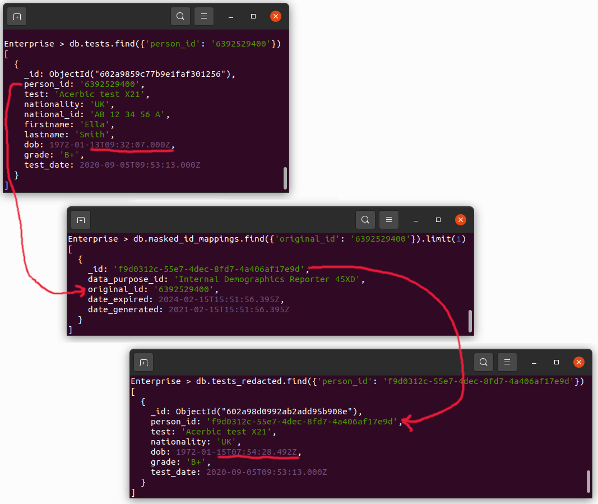

# MongoDB Reversible Data Masking Examples

## Introduction

Example project showing how MongoDB's aggregation pipeline can be used to perform data masking on records contained in a collection, where the changes are reversible (for those with sufficient privileges). A different project provides [non-reversible data masking examples](https://github.com/pkdone/mongo-data-masking). For the reasons why reversible data masking is often required and how this can be achieved in MongoDB, first read the blog post that accompanies this project at:

* [MongoDB Reversible Data Masking Examples blog post](https://pauldone.blogspot.com/2021/02/mongdb-reversible-data-masking.html) 

The sample scenario for this project will be based on an organisation collecting results of people's tests. These results could be from medical tests in a hospital, or from academic tests in a university, for example. Two key aggregation pipelines will be used in sequence:

 1. A pipeline to generate new unique anonymised IDs for each person appearing in a test result, into a new _mappings_ collection using the _idempotent masked-id generator_ pattern
 2. A pipeline to generate a masked version of the test results, where the person's id has been replaced with an anonymised (but reversible) one; additionally some other fields will be filtered out (e.g. _national id_, _last name_) or obfuscated with a partly randomised value (e.g _data of birth_). 
    
The screenshot below shows an example test result where the person's id from the original data-set has been mapped to a newly generated anonymous unique identifier (_\_id_) in a _mappings_ collection and subsequently the data masked data-set has been generated using this anonymised ID for the person's ID

 

Additionally, the red underlining highlights the redacted _date of birth_ field.
 
<br/>

## Prerequisites

* A [MongoDB database](https://docs.mongodb.com/manual/installation/) is running and accessible locally or over a network, using MongoDB version 4.4 or greater
* The [Mongo Shell](https://docs.mongodb.com/manual/mongo/) can be run from the local workstation
* From a command-line terminal on the workstation, the Mongo Shell has been launched referencing a MongoDB database deployment, where the connecting user has sufficient rights to create and modify any database. For example, execute the following (first changing the URL where necessary):

```bash
mongo 'mongodb://localhost:27017'
```

<br/>

## Populate The Sample Persons & Test Results Data In The Database

Via the open Mongo Shell, execute the following to remove the old `testdata` database (if it exists), and then add 3 records each containing information about a different person to the `persons` collection and add 3 test results records to the `tests` collection (2 tests results relating to one person, 1 test result relating to another person, leaving one person with no corresponding test records):

```javascript
use testdata;
db.dropDatabase();

//
// Persons collection
//
db.persons.createIndex({'person_id': 1},  {'unique': true});
db.persons.insertMany([
  {
    'person_id': '6392529400',
    'nationality': 'UK',
    'national_id': 'AB 12 34 56 A',
    'firstname': 'Ella',
    'lastname': 'Smith',
    'phone_nums': ['0722 644 2831', '01307 726 628'],
    'email': 'ella_smith@myemail.com',
    'dob': ISODate('1972-01-13T09:32:07Z'),
    'address': { 
        'number': 5625,
        'street': 'Tipa Circle',
        'city': 'Wojzinmoj',
        'country': 'UK',
    },
  },
  {
    'person_id': '1723338115',
    'nationality': 'US',
    'national_id': '714-555-0162',
    'firstname': 'Olive',
    'lastname': 'Ranieri',
    'phone_nums': ['626-555-0113', '202-555-0173'],
    'email': 'oranieri@warmmail.com',
    'dob ': ISODate('1985-05-12T23:14:30Z'),    
    'address': {
        'number': 9303,
        'street': 'Mele Circle',
        'city': 'Tobihbo',
        'country': 'US',
    },
  },
  {
    'person_id': '8732762874',
    'nationality': 'UK',
    'national_id': 'FC 13 12 83 B',
    'firstname': 'Toni',
    'lastname': 'Jones',
    'phone_nums': ['0722 127 2712', '0102 728 2710'],
    'email': 'tj@wheresmyemail.com',
    'dob ': ISODate('1991-11-23T16:53:56Z'),    
    'address': {
        'number': 1,
        'street': 'High Street',
        'city': 'Upper Abbeywoodington',
        'country': 'UK',
    },
  },
]);
db.persons.find().pretty();


//
// Tests collection
//
db.tests.createIndex({'person_id': 1, 'test': 1},  {'unique': true});
db.tests.insertMany([
  {
    'person_id': '6392529400',
    'test': 'Acerbic test X21',
    'nationality': 'UK',
    'national_id': 'AB 12 34 56 A',
    'firstname': 'Ella',
    'lastname': 'Smith',
    'dob': ISODate('1972-01-13T09:32:07Z'),    
    'grade': 'B+',
    'test_date': ISODate('2020-09-05T09:52:73Z'),
  },
  {
    'person_id': '1723338115',
    'test': 'Freevariant trial KJIIU764',
    'test_country': 'US',
    'firstname': 'Olive',
    'lastname': 'Ranieri',
    'dob': ISODate('1985-05-12T23:14:30Z'),    
    'results': [
        {'measurement': 97.72, 'sample_date': ISODate('2021-01-08T17:49:03Z')},
        {'measurement': 87.23, 'sample_date': ISODate('2021-01-18T18:33:28Z')},
        {'measurement': 90.33, 'sample_date': ISODate('2021-01-23T17:58:53Z')},
    ],
  },
  {
    'person_id': '1723338115',
    'test': 'Acerbic test X21',
    'nationality': 'US',
    'national_id': '714-555-0162',
    'firstname': 'Olive',
    'lastname': 'Ranieri',
    'dob': ISODate('1985-05-12T23:14:30Z'),    
    'grade': 'A',
    'test_date': ISODate('2020-07-14T13:27:86Z'),
  },
]);
db.tests.find().pretty();
```

<br/>

## Use The Idempotent Masked-ID Generator Pattern To Populate A Masked-ID Mappings Collection

A collection called `masked_id_mappings` will be used to record the mappings of original unique ids (e.g. person IDs), from the original unmasked collections, to newly generated [universally unique identifiers](https://en.wikipedia.org/wiki/Universally_unique_identifier) (UUIDs). This mappings collection will also capture the downstream data-set consumer purpose about why the data-set was requested and will be used (e.g. 'Internal Demographics Reporter 45XD', 'Test Results MI Analyzer 2021A'). This _purpose_ is to enable a different set of UUIDs to be generated per copy of masked data-set distributed to different consumers, so that data given to each doesn't share the same UUIDs. This helps to prevent identities from different distributed masked data-sets to be correlated together if a consuming party has access to more than one masked data-set. The `masked_id_mappings` collection also tracks when the UUID was generated, plus when the mapping record is marked to expire (using a [TTL index](https://docs.mongodb.com/manual/core/index-ttl/)), which, for this example, is when the UUID is over 3 years old (exclude this index TTL definition if you don't want an 'auto-expiry' policy to be enforced).

Below is an example of how a single mapping record in the `masked_id_mappings` collection might look.

```javascript
{
	"_id" : "021a6dab-a17a-4c4b-8c48-448becf62a70",
	"data_purpose_id" : "Partner ACME Data Dump Request",
	"original_id" : "8327323823",
	"date_generated" : ISODate("2021-02-14T11:40:11.035Z"),
	"date_expired" : ISODate("2024-02-14T11:40:11.035Z")
}
```

The _\_id_ field is used to store the newly generated UUID, in these examples.

To define this `masked_id_mappings` collection (specifically its indexes), execute the following in the Mongo Shell:

```javascript
db.masked_id_mappings.createIndex({'date_expired': 1},  {'expireAfterSeconds': 0});
db.masked_id_mappings.createIndex({'date_generated': 1});
db.masked_id_mappings.createIndex({'original_id': 1, 'data_purpose_id': 1},  {'unique': true});
```

The _idempotent masked-id generator_ pattern will be used to scan through all raw data collections and produce new corresponding UUIDs for the original unique record IDs that exist in the source collections. Essentially, this pattern is realised by an aggregation pipeline which is executed on each source collection, picking out the original unique id and then placing a record of this, with a newly generated UUID it is mapped to (plus the other metadata such as `data_purpose_id`, `date_generated`, `date_expired`) into the `masked_id_mappings` collection. The creation of each new mapping record is only executed if a mapping doesn't already exist for the original unique id of each source record. By being idempotent in this way, when further collections are run through the same aggregation pipeline, if some records from these other collections have the same original id as one that already exists in `masked_id_mappings`, a new UUID will not need to be generated, thus ensuring the same original unique id is always mapped to the same replacement UUID, regardless of how often it appears in various collections.

From the Mongo Shell execute the following to define the _idempotent masked-id generator_ aggregation pipeline (you will notice that two fields' values are intentionally marked as _TO-REPLACE_ - do not change these - just run the code as-is):

```javascript
var maskedIdGeneratprPipeline = [
    {'$project': {
        // GENERATE NEW MASKED UNIQUE ID (USE _id FIELD TO HOLD THIS)
        '_id': {'$function': {'lang': 'js', 'args': [], 'body':                   
                    function() {
                        // Extract the 32 hex digits from 'UUID(x)' text wrapper
                        return String(UUID()).substring(6,42);
                    }
               }},    
               
        // CAPTURE THE ORIGINAL ID
        'original_id': 'TO-REPLACE',
        
        // CAPTURE THE PURPOSE FOR THE DATA THAT NEEDED THE NEW MASKED NEW ID
        'data_purpose_id': 'TO-REPLACE',
        
        // CAPTURE CURRENT DATE-TIME
        'date_generated': '$$NOW',
        
        // CAPTURE WHEN THIS RECORD SHOULD BE AUTOMATICALLY DELETED (3 YEARS FROM CURRENT DATE-TIME)
        'date_expired': {'$add': ['$$NOW', 3*365*24*60*60*1000]},
    }},
    
    // ADD EACH RESULT RECORD TO 'REDACTED' COLLECTION ONLY IF DOESN'T ALREADY EXIST (IDEMPOTENT)    
    {'$merge': {'into': 'masked_id_mappings', 'on': ['original_id', 'data_purpose_id'],  'whenMatched': 'keepExisting', 'whenNotMatched': 'insert'}}
];
```

&nbsp;_NOTE_: The `masked_id_mappings` collection should be locked down with appropriate [RBAC](https://docs.mongodb.com/manual/core/authorization/) rules to restrict access.

Now before running the _idempotent masked-id generator_ aggregation pipeline against some collections, override the name of the unique id field of the source collections to be _person\_id_, in this case and set the purpose to be _'Internal Demographics Reporter 45XD'_ (the purpose label corresponding to a fictitious downstream consumer of masked data who has requested the data-set).

```javascript
// Set the name of the field (with $ reference prefix) for the original unique field to match in each record
// (for our examples for both the 'persons' & 'tests' collection this will be the 'person_id' field)
maskedIdGeneratprPipeline[0]['$project']['original_id'] = '$person_id';

// Generate IDs ready for a masked copy of the data-set to be used for the purpose 'Internal Demographics Reporter 45XD'
maskedIdGeneratprPipeline[0]['$project']['data_purpose_id'] = 'Internal Demographics Reporter 45XD';
```

Now it is time to run the aggregation _idempotent masked-id generator_ aggregation pipeline against some collections. First via the Mongo Shell, run this against the `tests` collection and then show the contents of the `masked_id_mappings` collection, as shown below:

```javascript
db.tests.aggregate(maskedIdGeneratprPipeline);
db.masked_id_mappings.find().pretty();
```

In the results you will notice only 2 mappings were generated even though there were 3 records in the _tests_ collection that the aggregation pipeline was run against. This is because there are only two unique persons in the test data. 

To further show that the _masked-id generator_ aggregation pipeline is indeed idempotent, execute the following to run the same aggregation pipeline against a different collection, the _persons_ collection:

```javascript
db.persons.aggregate(maskedIdGeneratprPipeline);
db.masked_id_mappings.find().pretty();
```

The _persons_ collection contains 3 unique persons, but as you can see from the output the `masked_id_mappings` collection only increased in record count by one, because two of the three _persons_ records had unique ids which were already captured in the `masked_id_mappings` collection from the pipeline having already been run against the _tests_ collection.

So far, ID mappings have only been generated for one downstream consumer masked data-set purpose, _'Internal Demographics Reporter 45XD'_. Now, lets pretend another party has requested a copy of the same _tests_ data-set, that needs to be masked, for the purpose 'Test Results MI Analyzer 2021A'. Therefore, execute the following mark the pipeline to now be used for the new purpose and to generate id mappings for this second purpose, for use in masking the _tests_ collection:

```javascript
// Generate IDs ready for a masked copy of the data-set to be used for the purpose 'Test Results MI Analyzer 2021A'
maskedIdGeneratprPipeline[0]['$project']['data_purpose_id'] = 'Test Results MI Analyzer 2021A';

db.tests.aggregate(maskedIdGeneratprPipeline);
db.masked_id_mappings.find().pretty();
```

The output should now look similar to below, with 3 mappings resulting from having run both the _tests_ collection and the _persons_ collection through the _idempotent masked-id generator_ for one purpose and 2 mappings resulting from having run just the _tests_ collection through the _idempotent masked-id generator_.

```javascript
{
	"_id" : "9277a551-997f-4347-897a-48c8557c5067",
	"data_purpose_id" : "Internal Demographics Reporter 45XD",
	"original_id" : "6392529400",
	"date_expired" : ISODate("2024-02-15T14:19:31.937Z"),
	"date_generated" : ISODate("2021-02-15T14:19:31.937Z")
}
{
	"_id" : "1cbd158f-a9c4-4c6a-bbbe-7cbb5105f1a0",
	"data_purpose_id" : "Internal Demographics Reporter 45XD",
	"original_id" : "1723338115",
	"date_expired" : ISODate("2024-02-15T14:19:31.937Z"),
	"date_generated" : ISODate("2021-02-15T14:19:31.937Z")
}
{
	"_id" : "5426154b-03b8-4131-952f-e3bf513cc93c",
	"data_purpose_id" : "Internal Demographics Reporter 45XD",
	"original_id" : "8732762874",
	"date_expired" : ISODate("2024-02-15T14:19:42.591Z"),
	"date_generated" : ISODate("2021-02-15T14:19:42.591Z")
}
{
	"_id" : "ca903f8a-b0e6-486f-9cf5-c0d621be043d",
	"data_purpose_id" : "Test Results MI Analyzer 2021A",
	"original_id" : "6392529400",
	"date_expired" : ISODate("2024-02-15T14:20:12.915Z"),
	"date_generated" : ISODate("2021-02-15T14:20:12.915Z")
}
{
	"_id" : "081e3920-4d12-4653-821e-e36bda4e77ce",
	"data_purpose_id" : "Test Results MI Analyzer 2021A",
	"original_id" : "1723338115",
	"date_expired" : ISODate("2024-02-15T14:20:12.915Z"),
	"date_generated" : ISODate("2021-02-15T14:20:12.915Z")
}
```

&nbsp;_NOTE_: The UUIDs shown above, for the _\_id_ fields will of course not match the values you have generated, by virtue of being unique!

<br/>


## Create A Data Masked Copy Of A Collection Using Reversible Unique IDs

So now we want to generate a new collection `tests_redacted` to hold the masked version of the data sourced from the `tests` collection, ready to then be distributed to the requesting 3rd party research group (i.e. where the purpose was given as 'Internal Demographics Reporter 45XD'). The copy of the data-set in the new collection, will have the original `persons_id` replaced with the UUID and, similar to the [non-reversible data masking examples project](https://github.com/pkdone/mongo-data-masking), will have some other fields obfuscated/redacted (e.g. `dob`) or filtered out (e.g. `national_id`).

Execute the following to specify the purpose variable, to create an index for the new `tests_redacted` collection, to define the aggregation pipeline to copy a masked version of the source collection, to execute the aggregation pipeline and finally to print out the contents of the resulting masked new collection:


```javascript
var dataPurposeId = 'Internal Demographics Reporter 45XD';

db.tests_redacted.createIndex({'person_id': 1, 'test': 1},  {'unique': true});

var maskTestPipeline = [
    // GET THE MASKED NEW UNIQUE ID MAPPED TO FROM PERSON ID
    {'$lookup': {
        'from': 'masked_id_mappings',
        'let': {
            'prsnid': '$person_id',
            'purposeId': dataPurposeId,
        },
        'pipeline': [
            {'$match':
                {'$expr':
                    {'$and': [
                         {'$eq': ['$original_id',  '$$prsnid']},
                         {'$eq': ['$data_purpose_id',  '$$purposeId']},
                    ]}
                }
            },
            {'$project': { 
                '_id': 0,
                'id_masked': '$_id',
            }},
        ],
        as: 'id_mapping'
    }},
    
    // GET FIRST UNIQUE ID FROM ARRAY (THERE SHOULD BE EXACTLY ONE)
    {'$set': {
        'id_mapping': {'$first': '$id_mapping'},
    }},
    
    // SET PERSON ID TO NOW BE THE LOOKED UP UNIQUE ID (OVERWRITING ORIGINAL SENSITIVE PERSON ID)
    {'$set': {
        'person_id': '$id_mapping.id_masked',
    }},
    
    // PARTIAL DATE OF BIRTH OBFUSCATION BY ADDING OR SUBTRACTING A RANDOM AMOUNT OF DAYS BY UP TO 15 DAYS MAX
    {'$set': {    
        'dob': {'$add': [
                    '$dob',
                    {'$floor': {'$multiply': [{'$subtract': [{'$rand': {}}, 0.5]}, 30*24*60*60*1000]}},
                ]},
    }},
    
    // RMEMOVE SOME OF THE MORE SENSTIVE FIELDS FROM THE ORIGINAL TESTS DATA RECORDS
    {'$unset': [
        '_id',
        'id_mapping',
        'firstname',
        'lastname',
        'national_id',
    ]},
    
    // ADD EACH RESULT RECORD TO 'REDACTED' COLLECTION ONLY IF DOESN'T ALREADY EXIST
    {'$merge': {'into': 'tests_redacted', 'on': ['person_id', 'test'],  'whenMatched': 'fail', 'whenNotMatched': 'insert'}},
];

db.tests.aggregate(maskTestPipeline);

db.tests_redacted.find().pretty();
```

The output should be similar as the following, but with different masked values for the `persond_id` and `dob` fields (plus different `_id` values of course);

```javascript
{
	"_id" : ObjectId("602a897a992ab2add95b8fdc"),
	"person_id" : "9277a551-997f-4347-897a-48c8557c5067",
	"test" : "Acerbic test X21",
	"nationality" : "UK",
	"dob" : ISODate("1972-01-05T19:50:33.880Z"),
	"grade" : "B+",
	"test_date" : ISODate("2020-09-05T09:53:13Z")
}
{
	"_id" : ObjectId("602a897a992ab2add95b8fdd"),
	"person_id" : "1cbd158f-a9c4-4c6a-bbbe-7cbb5105f1a0",
	"test" : "Freevariant trial KJIIU764",
	"test_country" : "US",
	"dob" : ISODate("1985-05-27T14:02:02.626Z"),
	"results" : [
		{
			"measurement" : 97.72,
			"sample_date" : ISODate("2021-01-08T17:49:03Z")
		},
		{
			"measurement" : 87.23,
			"sample_date" : ISODate("2021-01-18T18:33:28Z")
		},
		{
			"measurement" : 90.33,
			"sample_date" : ISODate("2021-01-23T17:58:53Z")
		}
	]
}
{
	"_id" : ObjectId("602a897a992ab2add95b8fde"),
	"person_id" : "1cbd158f-a9c4-4c6a-bbbe-7cbb5105f1a0",
	"test" : "Acerbic test X21",
	"nationality" : "US",
	"dob" : ISODate("1985-05-17T20:20:27.946Z"),
	"grade" : "A",
	"test_date" : ISODate("2020-07-14T13:28:26Z")
}
```

This resulting masked collection can then be exported/shipped to the requesting party, knowing that all sensitive data has been masked. The _date of birth_ field is now only approximate, rather than exact, but still carries meaning for researchers to look for patterns related to age, for example, given the variance from the real value is only 30 days or less. Many irrelevant personal details have been filtered out, and the 3rd party consumer of the masked data-set is unable to reverse engineer the real _person's ID_ because they do not have access to the `masked_id_mappings` collection. 


<br/>


## Determine Real ID By Reversing The Masked Person ID (When Appropriate Security Protocols Have Been Met)

For this scenario, lets imagine that the 3rd party research group of the data has spotted an issue of concern related to pattens they are seeing in test results for a specific anonymous person with the masked id `293bccc1-e820-450c-a934-82adaf20f68e`. As a result the 3rd party has redacted their copy of the test results, for the affected person, to include a new flag _Intervention Required_. Following whatever security & escalation protocol are in place between the two organisations, the masked and flagged data-set is now given back to the originating organisation for them only to be able to derive the real identify of the affected person, to enable an intervention to be instigated (or in simpler situations maybe just the anonymous person's masked ID is passed between the two organisations). The 3rd party research group still never gets to learn the real identify of the affected person.

To simulate this, execute the following to update the masked test results in the `tests_redacted` collection for the person listed as having the _nationality_ equal to __'US'__ - before running the code below __replace__ the text __'REPLACE_UUID'__ with the value of the `person_id` for the _US_ citizen as displayed in the results for `db.tests_redacted.find()`:

```javascript
db.tests_redacted.updateMany(
    {'person_id': 'REPLACE_UUID'},   // e.g. '1cbd158f-a9c4-4c6a-bbbe-7cbb5105f1a0'
    { $set: {'flag' : 'INTERVENTION-REQUIRED'}}
);

db.tests_redacted.find().pretty();
```

The output of the first of the two commands shown above should show `modifiedCount` to be `2` and in the results of the second command, `find()`, you should see 2 of the 3 test results now marked with a flag.

Given this masked data-set that contains the _intervention required_ flags, the original owner of the data-set, who has access the to the _tests_ and _masked_id_mappings_ collections, can now run an aggregation to show all persons that were flagged by the 3rd party research group, with their real personal data, to enable contact to be made. Execute the following aggregation pipeline to derive the real, non-anonymised data for the flagged persons only:

```javascript
var reverseFlaggedIdentitiesPipeline = [
    // ONLY GET ORIGINAL TEST RECORDS FOR REDACTED TEST RECORDS WHICH HAVE BEEN FLAGGED FOR FOLLOW UP
    {$match: {
        'flag': {'$exists': true},
    }},
    
    // LOOKUP ORIGINAL ID FROM 'masked_id_mappings' COLLECTION
    {$lookup: {
      from: 'masked_id_mappings',
      localField: 'person_id',
      foreignField: '_id',
      as: 'id_mapping'
    }},
    
    // GET FIRST ORIGINAL ID FROM ARRAY (THERE SHOULD BE EXACTLY ONE)
    {'$set': {
        'id_mapping': {'$first': '$id_mapping'},
    }},
    
    // LOOKUP THE TESTS COLLECTION WHICH CONTAINED THE ORIGINAL SENSITIVE PERSONAL INFO
    {'$lookup': {
        'from': 'tests',
        'let': {
            'orignId': '$id_mapping.original_id',
            'tst': '$test',
        },
        'pipeline': [
            {'$match':
                {'$expr':
                    {'$and': [
                         {'$eq': ['$person_id',  '$$orignId']},
                         {'$eq': ['$test',  '$$tst']},
                    ]}
                }
            },
        ],
        as: 'original_record'
    }},    
    
    // GET FIRST RECORD ONLY FROM ARRAY (THERE SHOULD BE EXACTLY ONE)
    {'$set': {
        'original_record': {'$first': '$original_record'},
    }},

    // RETAIN THE FLAG STATUS READY FOR THE FINAL DATA OUTPUT
    {'$set': {
        'original_record.flag': '$flag',
    }},
    
    // GROUP FLAGGED TESTS BY PERSON
    {'$group': {
      '_id': '$person_id',
      'person_id': {'$first': '$id_mapping.original_id'},
      'flagged_tests': {'$addToSet': '$original_record'},
    }},
];


db.tests_redacted.aggregate(reverseFlaggedIdentitiesPipeline).pretty();
```

The results should be the same as shown below (apart from the arbitrary _\_id_ fields), where the flagged person has been fully identified and the results include the list of flagged tests related to each person that had been flagged by the 3rd party.

```javascript
{
	"_id" : "1cbd158f-a9c4-4c6a-bbbe-7cbb5105f1a0",
	"person_id" : "1723338115",
	"flagged_tests" : [
		{
			"_id" : ObjectId("602a8279c77b9e1faf301251"),
			"person_id" : "1723338115",
			"test" : "Freevariant trial KJIIU764",
			"test_country" : "US",
			"firstname" : "Olive",
			"lastname" : "Ranieri",
			"dob" : ISODate("1985-05-12T23:14:30Z"),
			"results" : [
				{
					"measurement" : 97.72,
					"sample_date" : ISODate("2021-01-08T17:49:03Z")
				},
				{
					"measurement" : 87.23,
					"sample_date" : ISODate("2021-01-18T18:33:28Z")
				},
				{
					"measurement" : 90.33,
					"sample_date" : ISODate("2021-01-23T17:58:53Z")
				}
			],
			"flag" : "INTERVENTION-REQUIRED"
		},
		{
			"_id" : ObjectId("602a8279c77b9e1faf301252"),
			"person_id" : "1723338115",
			"test" : "Acerbic test X21",
			"nationality" : "US",
			"national_id" : "714-555-0162",
			"firstname" : "Olive",
			"lastname" : "Ranieri",
			"dob" : ISODate("1985-05-12T23:14:30Z"),
			"grade" : "A",
			"test_date" : ISODate("2020-07-14T13:28:26Z"),
			"flag" : "INTERVENTION-REQUIRED"
		}
	]
}
```

